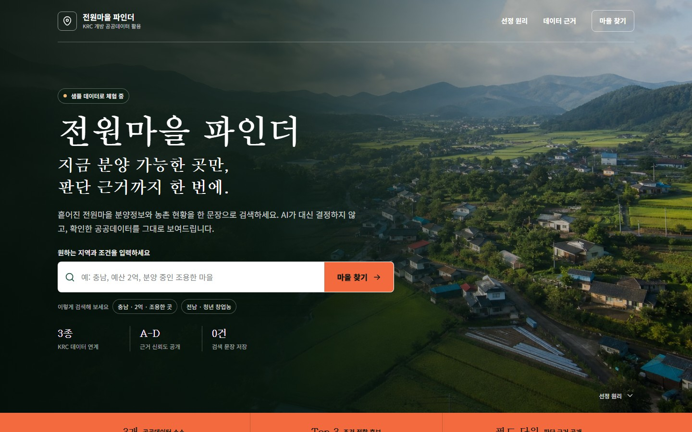
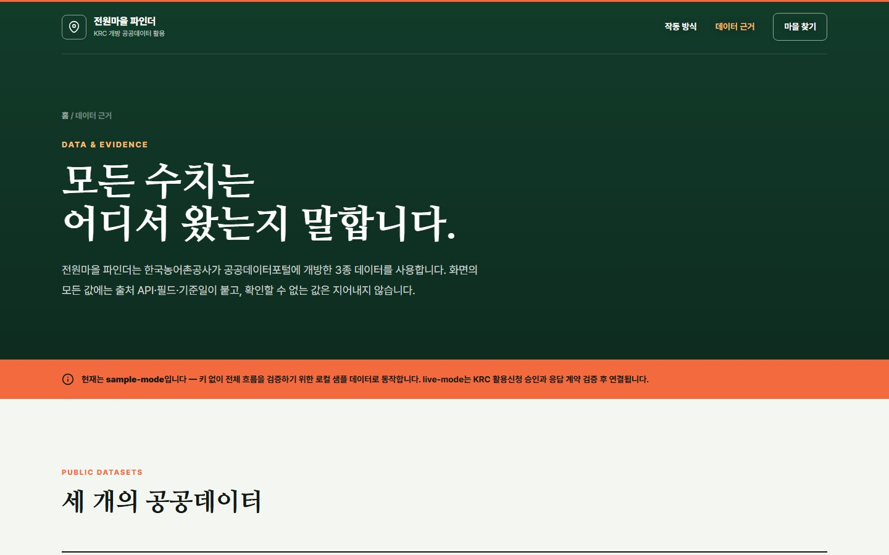

# 전원마을 파인더

> 지금 분양 가능한 전원마을을 공공데이터 근거와 함께 찾는 검색 서비스

[](https://github.com/Aithor-organization/krc-jeonwonmaeul-finder)


전원마을 파인더는 귀농·귀촌 후보를 막연한 이미지가 아니라 **분양 진행상태, 분양율, 계획세대수와 출처가 확인되는 지역 데이터**로 비교합니다. 자연어 검색, 결정론적 점수 계산, 수치별 근거 확인을 하나의 사용자 흐름으로 연결합니다.

현재 **전원마을 분양정보(전국 167곳)를 실시간 조회**하며, 서비스키가 없으면 샘플 데이터로 같은 흐름을 실행합니다. 농촌마을현황은 법정동코드로 결합해 인구·빈집을 함께 보여줍니다(167개 지구 중 151개). 논가뭄지도는 OpenAPI가 아닌 파일데이터라 아직 표본만 사용합니다 — 화면과 API는 이 상태를 숨기지 않습니다. 실제 분양·계약 판단은 공식 기관 확인이 필요합니다.

[화면 구조](#화면-구조) · [핵심 기능](#핵심-기능) · [작동 방식](#시스템-작동-방식) · [데이터 원칙](#데이터와-신뢰-원칙) · [실행](#로컬-실행) · [검증](#검증-상태)

---

## 화면 구조

새로운 프론트엔드는 목적이 다른 세 페이지를 하나의 정보 구조로 묶습니다.

```text
마을 찾기 / 검색 실행
        ↓
작동 방식 / 결과가 만들어지는 과정 확인
        ↓
데이터 근거 / 수치의 출처와 한계 확인
```

| 페이지 | 경로 | 사용자 과업 | 주요 구성 |
|---|---|---|---|
| **마을 찾기** | `/` | 조건을 입력하고 후보와 근거 확인 | 검색 히어로, 결과 카드, 상태 UI, 근거 리포트 모달 |
| **작동 방식** | `/how-it-works.html` | 추천이 만들어지는 원리 검토 | 8단계 파이프라인, 점수 공식, 데모 시나리오, 6대 원칙 |
| **데이터 근거** | `/data-evidence.html` | 데이터 출처와 신뢰 범위 검토 | KRC 데이터 3종과 각 연동 상태, 등급 기준, 정직한 결측 처리, FAQ |

세 페이지는 공통 헤더·푸터와 디자인 토큰을 사용하며, 상단 내비게이션과 각 페이지의 CTA로 서로 이동합니다.

### 마을 찾기

첫 화면에서 바로 자연어 검색을 시작합니다. 현재 데이터 모드, 검색 예시, 수록 지구 수, 근거 표기 원칙과 검색어 무저장 원칙을 첫 뷰포트에 함께 노출합니다.



- 검색 중, 성공, 빈 결과, 오류 상태를 같은 영역에서 일관되게 처리
- 결과 카드에서 진행단계·분양율·세대수·인구·빈집 수 비교
- 카드별 `수치 근거 확인` 버튼으로 Evidence Report 모달 진입
- 검색 조건을 만족하는 후보가 없으면 조건을 임의로 완화하지 않음

### 작동 방식

자연어 한 문장이 후보 목록으로 바뀌는 과정을 기술 모듈과 실패 처리까지 포함해 설명합니다. AI가 순위를 결정하지 않는다는 제품 원칙을 점수 공식과 실제 데모 흐름으로 보여줍니다.


- 요청 처리 8단계와 단계별 담당 모듈
- 진행단계 50%, 분양 가용성 30%, 선호 일치도 20% 공식
- 조건 입력 → 후보 카드 → 근거 리포트 데모
- 결정론, Evidence Binding, 자동완화 금지 등 6대 원칙

### 데이터 근거

화면에 표시되는 값의 출처와 결합 방식을 별도 페이지에서 설명합니다. sample-mode와 live-mode의 경계, 확인할 수 없는 데이터의 처리 방식도 함께 공개합니다.



- 전원마을 분양정보, 농촌마을현황, 논가뭄지도 필드와 샘플 응답
- 법정동코드 결합 수준에 따른 데이터 신뢰도 A~D
- 결측값 비추정, 물 정보 점수 분리, 검색어 무저장 원칙
- 단일 항목만 열리는 키보드·ARIA 대응 FAQ

> 문서의 화면 캡처는 Chromium `1440×900` 뷰포트에서 생성했습니다.

---

## 핵심 기능

| 기능 | 동작 |
|---|---|
| **검색 중심 시작 화면** | 소개 단계를 거치지 않고 첫 화면에서 바로 자연어 조건 입력 |
| **자연어 조건 해석** | 지역·예산·분양단계·최소 세대수·선호 조건을 `ParsedQuery`로 구조화 |
| **결정론적 후보 정렬** | 진행단계, 분양 가용성, 선호 일치도를 코드로 계산해 Top N 반환 |
| **조건 자동완화 방지** | 명시한 지역·단계·세대수 조건에 결과가 없으면 다른 후보를 임의로 섞지 않음 |
| **Evidence Report** | 화면 수치를 `api + field + value`에 연결해 카드별 근거 공개 |
| **신뢰도 A~D** | 법정동코드 직접 매칭 여부로 결합 수준 표시 (live 실측: A 136건 / C 15건) |
| **가뭄 참고 패널** | 상위 후보 시군의 농업가뭄 정보를 점수와 분리해 제공 |
| **정직한 결측 처리** | 공공데이터에 없는 분양가 등은 추정하지 않고 확인 불가로 표시 |
| **입출력 보호** | PII 마스킹, prompt injection 차단, 출력 PII 재검사 |
| **선택적 LLM 파서** | 사용자 키(BYOK) 또는 `USE_LLM=1`일 때 자연어 구조화에만 사용하고 실패 시 규칙 파서로 폴백 |
| **키 없이 실행** | 샘플 데이터로 검색·점수·근거·상태 UI 전체 흐름 실행 |

---

## 시스템 작동 방식

### 요청 흐름

```text
Browser
  ├─ GET /api/health       데이터 모드와 LLM 상태 확인
  └─ POST /api/search      자연어 또는 구조화 검색 요청
         ↓
     Input Guard           PII 마스킹 + injection 차단
         ↓
     Intent Parser         문장 → 지역/예산/단계/선호/세대수
         ↓
     KRC Data Client       분양정보 + 마을현황 + 논가뭄지도
         ↓
     Filter & Scoring      명시 조건 필터 + 결정론적 점수
         ↓
     Evidence Binding      노출 수치 → API/필드/값 연결
         ↓
     Drought Panel         시군 참고정보를 추천 점수와 분리
         ↓
     SearchResponse        후보 + 근거 + 경고 + 고지문
         ↓
Browser                   결과 카드와 근거 모달 렌더링
```

### 처리 단계

| 단계 | 모듈 | 책임 | 실패 처리 |
|---|---|---|---|
| 1. 모드 확인 | `main.py`, `config.py` | sample/live 및 LLM 상태 반환 | 화면에 데이터 상태 확인 실패 표시 |
| 2. 입력 보호 | `guards.py` | PII 마스킹, injection 패턴 검사 | 검색 중단 후 차단 사유 반환 |
| 3. 조건 해석 | `intent.py`, `llm_intent.py` | 자연어를 `ParsedQuery`로 변환 | LLM 실패 시 규칙 파서, 미인식 시 빈 결과 |
| 4. 데이터 조회 | `clients.py` | 분양·마을·가뭄 데이터 조회와 결합 | 현재 샘플 데이터와 상태 경고 사용 |
| 5. 필터·점수 | `scoring.py` | 명시 조건 필터와 적합도 계산 | 잘못된 숫자는 `None`, 조건 임의 완화 금지 |
| 6. 근거 검증 | `evidence.py` | 카드 수치의 출처 바인딩 검사 | 미바인딩 값은 확정값처럼 노출하지 않음 |
| 7. 응답 조립 | `orchestrator.py` | 후보·가뭄·근거·경고·고지 조립 | 데이터 없음 안내와 빈 목록 반환 |
| 8. 화면 렌더링 | `app.js` | 로딩·성공·빈 결과·오류·모달 상태 관리 | 타임아웃과 재검색 안내 제공 |

### 점수 원리

```text
적합도 = 0.5 × 진행단계 + 0.3 × 분양 가용성 + 0.2 × 선호 일치도
```

- **진행단계**: 분양중 `1.0`, 분양예정 `0.6`, 분양완료 `0.1`
- **분양 가용성**: `(100 - 분양율) / 100`
- **선호 일치도**: 마을 자원·인구·빈집 데이터와 요청 선호의 일치 비율
- **물 사정**: 시군 단위 참고정보이므로 적합도 계산에서 제외

필터, 점수, 데이터 결합과 근거 검증은 같은 입력에 같은 결과를 내는 코드가 담당합니다. LLM은 활성화된 경우에도 자연어를 구조화할 뿐 최종 순위를 생성하지 않습니다.

---

## 데이터와 신뢰 원칙

### KRC 데이터셋

| 데이터 | data.go.kr ID | 시스템 역할 | 현재 상태 |
|---|---:|---|---|
| 전원마을 분양정보 | `15104395` | 진행단계·분양율·계획세대수 | **실시간 연동** (167건) |
| 농촌마을현황 | `15104291` | 인구·빈집 | **결합** — 법정동코드 완전일치 151/167 지구 (사전 빌드 스냅샷) |
| 마을 자원정보 | `15104291` | 마을 자원 목록 (`resourceVill`) | **결합** — 내용이 있는 마을 17/127 |
| 논가뭄지도 | `15117185` | 시군 농업가뭄 참고 패널 | 미연동 (OpenAPI 아닌 CSV) |
| 저수지 수위정보 | `15099919` | 향후 실시간 저수율 확장 | 미연결 |
| 전원마을 분양**공고**정보 | 농정원 `15020843` | 신청일정·분양가·사진 후보 | **조사 후 미채택** — 아래 참조 |

### 데이터 인벤토리 — 무엇이 있고 무엇이 없는가

이 서비스가 "정보가 적어 보이는" 이유는 구현 누락이 아니라 **원천 필드가 그만큼뿐**이기 때문입니다.
아래는 추측이 아니라 전수 실호출로 센 값입니다 (2026-07-30).

**전원마을 분양정보 — 필드 9개가 서비스의 뼈대입니다.**

| 필드 | 의미 | 값 있음 | 0 제외 |
|---|---|---:|---:|
| `zoneName` · `sidoNm`/`sggNm`/`emdNm` | 지구명 · 지역 | 100% | **100%** |
| `progrsStep` | 진행단계 | 100% | **100%** |
| `planHscnt` | 계획세대수 | 100% | **96%** |
| `bndeLttotHscntPer` | 분양율 | 100% | 🔴 **16%** |

분양율은 167건 **전부** 값이 오지만 141건이 `0`입니다. 실제로 판단 가능한 건 26건뿐이라
화면에서 "확인 불가"로 적습니다. **날짜·가격·연락처·URL 필드는 이 API에 존재하지 않습니다.**

**농촌마을현황 — 조인된 127개 마을 기준**

| 지표 | 채움 | 비고 |
|---|---:|---|
| 마을명 | 100% | |
| 인구 · 고령화율 · 총주택수 | 73% | 연령 16칸 합산 |
| 빈집 수 | 78% | 1호↑ 34 · 조사된 0이 65 · 미조사 28 |
| 마을 소개 | 65% | |
| 슬레이트 주택 | 28% | |
| 자원 목록 | 13% | |
| ~~주택 연식 5구간~~ | 18~28% | 🔴 **미표시** — 5칸 합이 총주택수와 57곳 중 23곳만 일치해 구간 라벨을 확신할 수 없음 |

**167 지구 기준 실제 화면 커버리지** (마을이 붙는 곳이 127/167이라 위 표보다 낮습니다)

| 화면 지표 | 커버리지 |
|---|---:|
| 지역 · 지구명 · 진행단계 | 100% |
| 계획세대수 | 96% |
| 마을 빈집 (조사 여부) | 59% |
| 인구 · 고령화율 · 총주택수 | 56% |
| 마을 소개 | 50% |
| 슬레이트 주택 | 22% |
| 분양율 | 🔴 16% |
| 자원 목록 | 10% |
| 분양가 · 신청일정 · 신청페이지 · 사진 | **0%** |

### 신청일정·분양가·사진은 왜 없는가 (조사 기록)

"언제 신청하는지"를 붙이려고 별도 API를 찾아 **정식 키를 발급받아 전수 검증**했습니다.

농정원 **전원마을 분양공고정보**(`TI_EPIS_SRC_VIGE_LOT_PBL_INFO`)에는 스키마상 원하던 필드가
모두 있습니다 — 분양공고일, 담당자 연락처, 분양가, 관련 홈페이지, 공고문 URL, 조감도·위치도·현장사진.
지구명과 계획세대수가 일치해 **우리 167곳 중 67곳이 같은 원천**임도 확인했습니다.

그런데 쓸 수 없었습니다.

| 필드 | 채움 | 판정 |
|---|---:|---|
| 담당자 전화번호 | 100% | 유일하게 쓸 만함 (단 2015~2019년 정보) |
| 조감도·위치도·현장사진 | 61~68% | 🔴 **URL 316개를 전부 내려받아 md5 비교 → 진짜 사진 0개.** 전 지구가 같은 로고 아이콘(`2743116b`, 23,798 B) |
| 분양가 | 65% | 🔴 명세 단위(`㎡·천원`)로 환산하면 평당 1만원 — 단위가 확정되지 않아 금액은 표시 불가 |
| 분양공고일 | 12% | 실질 부재 |
| 관련 홈페이지 · 공고문 | **0%** | 전건 빈 값 |

데이터 범위도 **2009~2015년 선정분 100건**, 최신 갱신이 2019년입니다.

**결론: 신청 일정과 신청 페이지는 현재 공공데이터로 제공할 수 없습니다.** 그래서 화면에서
"공공데이터에 없다"고 적고 관할 시군구청을 안내합니다 — 없는 값을 그럴듯하게 채우지 않습니다.

### 여섯 가지 원칙

1. **결정론 우선, AI 최소**: 판단 가능한 작업은 재현 가능한 코드로 처리합니다.
2. **Evidence Binding**: 노출 수치는 `api + field + value` 근거를 가져야 합니다.
3. **조건 자동완화 금지**: 빈 결과를 피하려고 사용자의 조건을 몰래 바꾸지 않습니다.
4. **상관관계와 인과관계 분리**: 시군 가뭄정보를 특정 마을의 물 사정으로 단정하지 않습니다.
5. **실패 상태 공개**: sample-mode, 필터 한계, LLM 폴백과 결측 사유를 숨기지 않습니다.
6. **개인정보와 외부호출 경계**: 검색어를 저장하지 않고 PII와 외부 호스트를 통제합니다.

### 실행 모드

| 모드 | 상태 | 동작 |
|---|---|---|
| **sample-mode** | `KRC_SERVICE_KEY` 없을 때 | `app/backend/data/samples/*.json`으로 전체 흐름 실행 |
| **live-mode** | `KRC_SERVICE_KEY` 있을 때 | 전원마을 분양정보를 실시간 조회 (전국 167건) |
| **LLM parser** | 선택 | 사용자가 화면에서 키를 넣거나(BYOK) 서버 `USE_LLM=1`일 때 활성화, 실패 시 규칙 파서 폴백 |

`KRC_SERVICE_KEY`를 설정하면 live-mode로 전환되고 `/api/health`의 `sample_mode`가 `false`가 됩니다. 호출이 실패하면 샘플 데이터로 내려앉되 그 사실을 응답 `warnings`에 남깁니다.

### 자연어 파싱 키 — 설정 페이지 (BYOK)

LLM 파싱은 **선택 기능**이며 운영자가 OpenAI 키를 부담하지 않습니다. 방문자가 **[`/settings.html`](app/frontend/settings.html)** 에서 자기 키를 직접 넣습니다. 검색 화면에는 지금 어느 파서로 검색되는지 알리는 한 줄과 설정 링크만 둡니다 — 검색 흐름에 입력 폼을 끼워넣지 않습니다.

| 항목 | 처리 |
|---|---|
| 입력 위치 | `/settings.html` 한 곳. 헤더·푸터에서 모든 페이지로부터 접근 가능 |
| 키 보관 | 브라우저 `sessionStorage` — 탭을 닫으면 사라지고 다른 탭·기기와 공유되지 않음 |
| 저장 규칙 | [`key-store.js`](app/frontend/key-store.js) 단일 출처. 검색 화면과 설정 화면이 같은 코드를 씀 |
| 화면 되비침 | 저장된 키는 입력란에 다시 넣지 않고 `sk-pro…uvwx`로 마스킹만 표시 |
| 서버 저장 | 없음. 요청 본문으로 받아 그 요청의 OpenAI 호출에만 쓰고 버림 |
| 로그·응답 노출 | 없음. OpenAI 오류 응답이 키 일부를 되돌려주므로 `llm_intent.redact()`로 마스킹하고, 오류 본문 자체를 싣지 않음 (`tests/test_byok.py`가 고정) |
| 키 확인 | 설정 화면의 "키 확인"이 실제 검색을 한 번 보내 LLM 경로를 탔는지 응답으로 판정 |
| 키가 없을 때 | 규칙 파서로 동작 — 검색 자체는 그대로 됨 |

수치와 근거는 두 경우 모두 공공데이터에서 그대로 가져옵니다. LLM은 문장을 조건으로 바꿀 뿐 순위나 숫자를 만들지 않습니다.

**로컬 개발**에서 매번 넣기 번거로우면 `OPENAI_API_KEY` 환경변수, 또는 저장소 루트의 `llm-key.local.md`(`.gitignore` 제외됨)에 `openai api key : sk-...` 한 줄을 둘 수 있습니다. **배포에는 쓰지 않습니다** — 저장소가 public이라 키가 담긴 파일은 커밋할 수 없습니다.

**live-mode에서 알아둘 점**

- **진행단계는 변환값입니다.** 실 API는 공사 진행단계(준비단계·기반조성공사단계·주택건축 준비단계·주택건축 단계·건축완료후 입주단계)를 반환하므로, 서비스 어휘(분양예정·분양중·분양완료)로 매핑해 표시하고 그 사실을 `warnings`로 고지합니다.
- **마을 상세(인구·빈집수)는 스냅샷입니다.** 농촌마을현황 API는 서버 필터가 없어 전건(2.8만)이 통째로 오고 13초·31MB가 듭니다 — 요청 때마다 할 수 없어 `scripts/build_village_index.py`가 분양지구에 붙는 마을만 미리 추립니다(30KB). 기준일은 검색 결과 `notes`에 표시됩니다.
- **법정동코드 완전일치만 씁니다.** 읍면동까지 느슨하게 맞추면 90%→99%가 붙지만 읍면동 하나에 마을이 중앙값 22개라, 그중 하나를 고르는 건 추측입니다. 붙지 않는 16개 지구는 `확인 불가`로 둡니다.
- **마을 인구 0은 미입력**으로 봅니다 — 주택 200채인 마을에 인구 0명(원주 서곡10리)은 불가능하므로 조사 미입력입니다(151건 중 38건).
- **계획세대수 0은 미공개**로 보고 "확인 불가"로 처리합니다(실측 7/167건).

**마을 인덱스 갱신** (원천 데이터가 바뀌었을 때):

```bash
KRC_SERVICE_KEY=... python3 scripts/build_village_index.py --dry-run   # 통계만
KRC_SERVICE_KEY=... python3 scripts/build_village_index.py            # 파일 기록
```

| 데이터셋 | 엔드포인트 |
|---|---|
| 전원마을 분양정보 (15104395) | `https://apis.data.go.kr/B552149/raiseSaleVill/saleVill` |
| 농촌마을현황 (15104291) | `https://apis.data.go.kr/B552149/raiseRuralVill/infoVill` |
| 논가뭄지도 (15117185) | OpenAPI 아님 — 파일데이터(CSV) 제공 |

---

## API

| Method | Path | 역할 |
|---|---|---|
| `GET` | `/api/health` | 서버, 데이터 모드, LLM 상태 확인 |
| `POST` | `/api/search` | 자연어 또는 구조화 조건으로 후보 검색 |
| `GET` | `/api/village/{gu_id}` | 허용된 필드만 포함한 단일 지구 상세 조회 |

`POST /api/search` 응답은 후보와 근거를 분리하지 않습니다.

```json
{
  "query_parsed": {"region": {"sido": "충청남도"}, "sale_stage": ["분양중"]},
  "top": [{"gu_name": "홍성 갈산 전원마을", "score": 0.895, "confidence_grade": "A"}],
  "drought_panel": {"sigungu": "홍성군", "drought_stage": "관심"},
  "evidence": [{"api": "15104395", "field": "분양율", "value": 35}],
  "warnings": ["sample-mode: 샘플 데이터로 동작합니다."],
  "disclaimer": "공공데이터 기반 참고정보이며 최종 계약·분양은 공식 기관 확인이 필요합니다."
}
```

---

## 디자인 시스템

시각 방향은 **Grounded civic editorial**입니다. 농촌 풍경의 현장성과 공공서비스의 명료함을 결합하고, 과장된 추천보다 확인 가능한 정보가 먼저 보이도록 설계했습니다.

| 영역 | 기준 |
|---|---|
| 색상 | Forest `#123b2a`, Signal Orange `#f26a3d`, Paper `#f4f6f1`, Ink `#101914` |
| 타이포그래피 | 제목 `MaruBuri`/`Nanum Myeongjo`, 본문 `Pretendard`, 코드 `JetBrains Mono` |
| 형태 | 컨트롤·카드 최대 8px, 상태·검색 예시에만 pill 사용 |
| 레이아웃 | 1240px 콘텐츠 폭, 비대칭 편집 레이아웃, 전체 폭 정보 밴드 |
| 상태 표현 | sample-mode, 경고, 신뢰도, 빈 결과와 오류를 텍스트로 명시 |
| 접근성 | skip link, 의미 있는 landmark, focus-visible, ARIA 상태, 키보드 모달·FAQ |

프론트엔드 스타일 책임은 다음처럼 분리합니다.

| 파일 | 책임 |
|---|---|
| `style.css` | 토큰, 기본 요소, 공통 헤더, 랜딩 히어로와 검색 컨트롤 |
| `results.css` | 결과 카드, 로딩·빈 결과·오류 상태 |
| `sections.css` | 랜딩 정보 섹션, CTA, 푸터, 근거 모달 |
| `responsive.css` | 랜딩 태블릿·모바일·저높이 대응 |
| `pages.css` | 작동 방식·데이터 근거 페이지와 해당 반응형 규칙 |
| `app.js` | 검색, 결과 상태, 데이터 모드, 근거 모달 |
| `pages.js` | 데이터 근거 FAQ의 단일 열림·ARIA 상태 |

세부 시각 규칙과 금지 항목은 [`brand-spec.md`](brand-spec.md)를 참고하세요.

---

## 로컬 실행

Python 3.11 이상이 필요합니다. 프론트엔드는 정적 HTML/CSS/JavaScript이므로 별도 Node 빌드가 필요하지 않습니다.

```bash
cd app/backend
python -m venv .venv

# 가상환경 활성화 후
python -m pip install -r requirements.txt
python -m pytest tests -q
python -m uvicorn main:app --host 127.0.0.1 --port 8000
```

- 마을 찾기: <http://127.0.0.1:8000>
- 작동 방식: <http://127.0.0.1:8000/how-it-works.html>
- 데이터 근거: <http://127.0.0.1:8000/data-evidence.html>
- 헬스체크: `GET http://127.0.0.1:8000/api/health`

검색 예시:

```bash
curl -X POST http://127.0.0.1:8000/api/search \
  -H "Content-Type: application/json" \
  -d '{"query":"충남, 예산 2억, 분양 중인 조용한 마을"}'
```

LLM 파싱을 쓰려면 화면의 "AI 파싱 켜기"에 OpenAI 키를 넣거나, 요청에 직접 실어 보냅니다:

```bash
curl -X POST http://127.0.0.1:8000/api/search \
  -H "Content-Type: application/json" \
  -d '{"query":"충남에서 세대수 많고 아직 안 팔린 데","openai_api_key":"sk-..."}'
```

서버에 고정해두려면 `USE_LLM=1`과 `OPENAI_API_KEY`를 설정합니다(로컬 개발용). 세부 모델 라우팅은 [`app/README.md`](app/README.md)에 설명되어 있습니다.

---

## 배포 (Vercel)

[`vercel.json`](vercel.json)이 Framework Preset을 `fastapi`로 고정합니다. 대시보드에서 건드릴 것은 두 개뿐입니다.

| 설정 | 값 |
|---|---|
| **Root Directory** | **저장소 루트** (`app`·`app/backend`로 바꾸지 말 것) |
| 환경변수 | `KRC_SERVICE_KEY` 만. `OPENAI_API_KEY`는 넣지 않음(BYOK) |
| Framework Preset | `vercel.json`이 덮어씀 — 대시보드 값 무관 |

진입점은 루트의 [`server.py`](server.py)입니다. Vercel Python 런타임은 진입점을 프로젝트 루트나 `src/`·`app/`·`api/` **바로 안**에서만 찾는데([문서](https://vercel.com/docs/functions/runtimes/python)), 실제 앱은 `app/backend/main.py`로 한 단계 더 깊습니다. `server.py`가 `app/backend`를 `sys.path`에 넣고 `app`을 재노출해 그 간극을 메웁니다.

### 배포에서 밟은 함정 3건

**0. FastAPI 프리셋은 자동 감지되지 않는다.** Vercel 프레임워크 정의(`api.vercel.com/v1/frameworks`)에서 `fastapi`는 `detectors: null`입니다 — 파일을 보고 알아서 붙는 프리셋이 아니라 **명시적으로 골라야만** `@vercel/python` 런타임이 붙습니다. 대시보드에서 "Other"를 고르면 Python이 아예 실행되지 않고 저장소가 통째로 정적 파일로 서빙됩니다(`server.py`가 텍스트로 내려옴). `vercel.json`의 `"framework": "fastapi"`가 이걸 코드로 고정합니다.

**1. Root Directory를 `app/backend`로 잡으면 안 된다.** 진입점은 찾지만 `app/frontend`가 루트 밖으로 나가 번들에서 빠집니다. `config.FRONTEND_DIR`가 존재하지 않게 되어 정적 마운트가 통째로 건너뛰어지고, `/api/*`만 살아남은 채 `/`는 404가 됩니다.

**2. 루트 `requirements.txt`에 패키지 이름이 그대로 있어야 한다.** Vercel은 이 파일에서 의존성 이름을 찾아 프레임워크를 감지합니다. 중복을 피하려고 `-r app/backend/requirements.txt` 참조만 두면 `fastapi` 문자열이 없어 **Python 런타임이 아예 안 붙고**, 배포가 정적 파일 서빙으로 떨어집니다(`server.py`가 텍스트로 내려오고 모든 경로가 404). 그래서 **루트가 런타임 의존성 정본**이고 `app/backend/requirements.txt`가 `-r ../../requirements.txt`로 참조하며 `pytest`만 더합니다.

---

## 프로젝트 구조

```text
app/
├─ backend/
│  ├─ main.py                 FastAPI 엔드포인트와 정적 프론트 서빙
│  ├─ orchestrator.py         검색 파이프라인과 응답 조립
│  ├─ guards.py               PII·injection·SSRF 경계
│  ├─ intent.py               결정론적 자연어 파서
│  ├─ llm_intent.py           선택적 LLM 파서와 폴백
│  ├─ clients.py              KRC 데이터 접근 계층
│  ├─ scoring.py              결정론적 적합도 계산
│  ├─ evidence.py             수치 근거 바인딩
│  ├─ data/samples/           키 없이 실행하는 샘플 데이터
│  └─ tests/                  API·보안·파싱·점수·근거·정적 페이지 테스트
└─ frontend/
   ├─ index.html              마을 찾기 랜딩 SPA
   ├─ how-it-works.html       8단계 파이프라인 설명
   ├─ data-evidence.html      데이터셋·신뢰도·FAQ
   ├─ app.js                  검색과 근거 모달 상호작용
   ├─ pages.js                하위 페이지 상호작용
   ├─ style.css               공통 토큰·헤더·검색 히어로
   ├─ results.css             결과 UI
   ├─ sections.css            공통 섹션·푸터·모달
   ├─ responsive.css          랜딩 반응형 규칙
   ├─ pages.css               하위 페이지와 반응형 규칙
   └─ assets/                 랜딩 이미지
docs/images/                  README용 페이지 캡처
```

---

## 검증 상태

- `pytest`: **351 passed, 2 skipped** · 커버리지 **99%**
- `node --check`: `app.js`, `pages.js` 통과
- FastAPI `/api/health`: 200 OK
- Chromium 데스크톱 `1440×900` / 모바일: 렌더·가로 오버플로 검증
- 메인 검색과 결과 상태, 근거 모달, 하위 페이지 이동, FAQ ARIA 상태 검증
- 콘솔 오류, page error, 실패한 네트워크 응답 없음

**실키 교차검증** (2026-07-28, 실제 KRC + OpenAI 키):

- 원천 API 167건을 별도로 받아 앱을 거치지 않고 재계산 → **전수 대조 불일치 0건**
- 실LLM 5질의(`gpt-5.4-nano`/`mini` 실호출) 수치·필터·점수 **불일치 0건**
- 점수 산식 좌변=우변 전 지역 스윕 117건 **불일치 0건**
- 프로덕션 ↔ 로컬 정답지 3질의 **일치**

이 과정에서 표시 결함 6건을 발견해 수정했습니다 — 산식 표시 충돌, 거짓 재현성 주장,
중복 지구 노출, 분양율 0을 확정값으로 표시, LLM의 지역/금액 혼동, 0건 검색의 빈 섹션.
자세한 내용은 커밋 이력(`c9f295a`, `a5522c0`, `ae75855`)에 남겼습니다.

**표시 계층 교정** (2026-07-29~30): 수치는 맞는데 **화면이 사실과 다르게 말하던** 결함을 연속으로 잡았습니다.
숫자 검증만으로는 잡히지 않고 실제 화면을 봐야 드러나는 종류입니다.

| 결함 | 교정 |
|---|---|
| 분양율 "확인 불가"의 사유가 뭉뚱그려짐 | 확정 / 단계로 추정 / 값 보류 / 기록 없음 4상태 분리 (`rate_status`) |
| "지금 들어갈 수 있는 곳" — 데이터가 뒷받침 못 함 | 헤드라인을 "지금 분양 중인 곳"으로 정정 |
| 빈집 0을 화면에서 숨김 | 🔴 **조사된 0(65곳)과 미조사(28곳)가 똑같이 침묵** → 3상태 분리 |
| 마을이 안 붙는 지구의 카드가 통째로 빔 | 왜 비었는지와 "읍면동만 맞춰 추측하지 않는다"를 명시 |
| "마을 빈집"이 분양받을 집으로 읽힘 | 계획세대수와의 차이를 카드에 못박음 |
| `top_n`이 Pydantic에서 조용히 버려짐 | `SearchRequest`에 필드 선언 — 전체 결과 페이지가 실제로 동작 |

**데이터 인벤토리 전수 실측** (2026-07-30): 4개 API의 전 필드를 실호출로 세어
[데이터 인벤토리](#데이터-인벤토리--무엇이-있고-무엇이-없는가) 표를 만들었습니다. 농정원 API는 정식 키를
발급받아 100건 전수 + **이미지 URL 316개를 실제로 내려받아** 전부 플레이스홀더임을 확인했습니다.

**아직 하지 않은 것**: CI 자동 실행, 브라우저 E2E 자동화, 부하 테스트.

캡처 원본:

- [`landing-page.jpg`](docs/images/landing-page.jpg)
- [`how-it-works-page.jpg`](docs/images/how-it-works-page.jpg)
- [`data-evidence-page.jpg`](docs/images/data-evidence-page.jpg)

---

## 문서

| 파일 | 내용 |
|---|---|
| [`MVP제안서.md`](MVP제안서.md) | 심사·발표용 문제·솔루션·공공가치 요약 |
| [`기술명세서.md`](기술명세서.md) | 아키텍처·데이터·AI·보안·평가 설계 |
| [`spec.md`](spec.md) | 검증 가능한 Acceptance Criteria |
| [`plan.md`](plan.md), [`tasks.md`](tasks.md) | 구현 계획과 태스크 DAG |
| [`app/README.md`](app/README.md) | 실행 모드와 LLM 라우팅 상세 |
| [`brand-spec.md`](brand-spec.md) | 제품 포지션, 시각 언어와 금지 규칙 |

## 로드맵

### P0 · 실데이터 연결

- [x] 공공데이터 활용신청 승인 후 실제 응답 샘플 확보 — 전국 167건
- [x] `clients.py` live-mode와 KRC 호스트 allowlist 적용
- [x] 오퍼레이션명·조회 파라미터·필드 타입 검증 — 167건 전수 대조
- [x] live 호출 실패 상태와 fallback 모드를 사용자에게 명시
- [x] **농촌마을현황(2.8만 건) 조인** — 법정동코드 완전일치 151/167 지구. 인덱스 사전 빌드(30KB)로 런타임 즉시 조회
- [ ] **논가뭄지도 연동** — OpenAPI가 아닌 파일데이터(CSV)라 현재 5개 시군 표본만 사용
- [x] **신청일정·분양가·사진 원천 조사** — 농정원 `15020843` 정식 키로 전수 검증 → **채택 불가** 판정 (사진 316개 전부 플레이스홀더, 분양가 단위 불명, 공고일 12%)
- [ ] 담당자 연락처(67곳 100% 보유) 표시 여부 결정 — 2015~2019년 정보라 정확도 고지가 전제

### P1 · 제품 완성도

- [x] 검색 중심 반응형 랜딩페이지
- [x] 작동 방식·데이터 근거 하위 페이지
- [x] 실제 브라우저 캡처와 데스크톱·모바일 검증
- [x] 시군구 규칙 파싱 강화 — 금액/지역 충돌 가드(‘예산 2억’ vs 예산군), LLM 답도 동일 검증
- [ ] 지구 위치 지도와 인근 시설 표시
- [ ] 파싱 평가셋 100개 확대 및 규칙/LLM baseline 비교

### P2 · 운영 신뢰성

- [ ] GitHub Actions에 pytest·정적 검사 품질 게이트 추가
- [ ] API 성공률·응답시간·fallback 관측 화면
- [ ] 공공데이터·생성 이미지·모델 자산대장 관리
- [ ] 운영 환경과 데이터 이용조건 검토 후 배포 구성

---

제3회 KRC 인공지능 디지털 혁신 공모전 서비스개발 부문 MVP입니다. 배포본은 **live-mode**로 공공데이터를 실시간 조회합니다(`/api/health`의 `sample_mode: false`). 다만 분양율은 16%만 원천에 기록돼 있고 신청일정·분양가는 공공데이터에 존재하지 않으므로, 최종 분양상태와 계약조건은 반드시 관할 시군구청과 공식 분양처에서 다시 확인해야 합니다.
